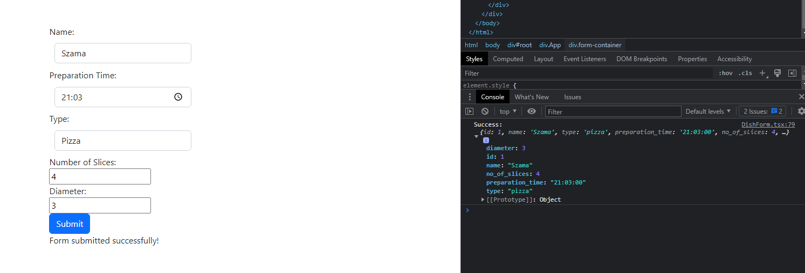

# Project HexOceanFrom
## Requirements

- Node.js version 18.12.1
- NPM version 9.2.0

## Project Components

- TypeScript
- Live Preview (originally intended with Yup, but had to use Formik)
- Bootstrap
- Successful form submission verification on the user side
- Proper validation handling (also errors from API responses in console for developers)
- Formik library for form handling

## Project Setup Instructions

To set up the project, follow the instructions below:

1. Clone the repository to your local machine.
2. Navigate to the main project directory.
3. Open a terminal and run the command `npm install` to install all the required dependencies.
4. Once the installation is complete, run the command `npm start` to start the project.
5. Open a web browser and go to `http://localhost:3000` to see the project in Live Preview mode.

Now the project is ready to be run and edited.

## Summary

I initially intended to implement more efficient form validation using the Yup library. However, I encountered difficulties in handling errors that arose during the validation of conditional fields. Despite my efforts, I was unable to resolve these issues. The Yup version, which can be found in the "yupValidation.txt" file, contains cleaner code overall, except for the fact that conditional field validation does not function correctly.

I acknowledge the potential benefits of utilizing Yup for form validation and understand that its implementation could have improved the codebase. However, due to the challenges encountered with handling conditional fields, I opted to use alternative error variables instead. The project remains functional, but it may not possess the same level of code cleanliness that would have been achieved with Yup's conditional validation.

